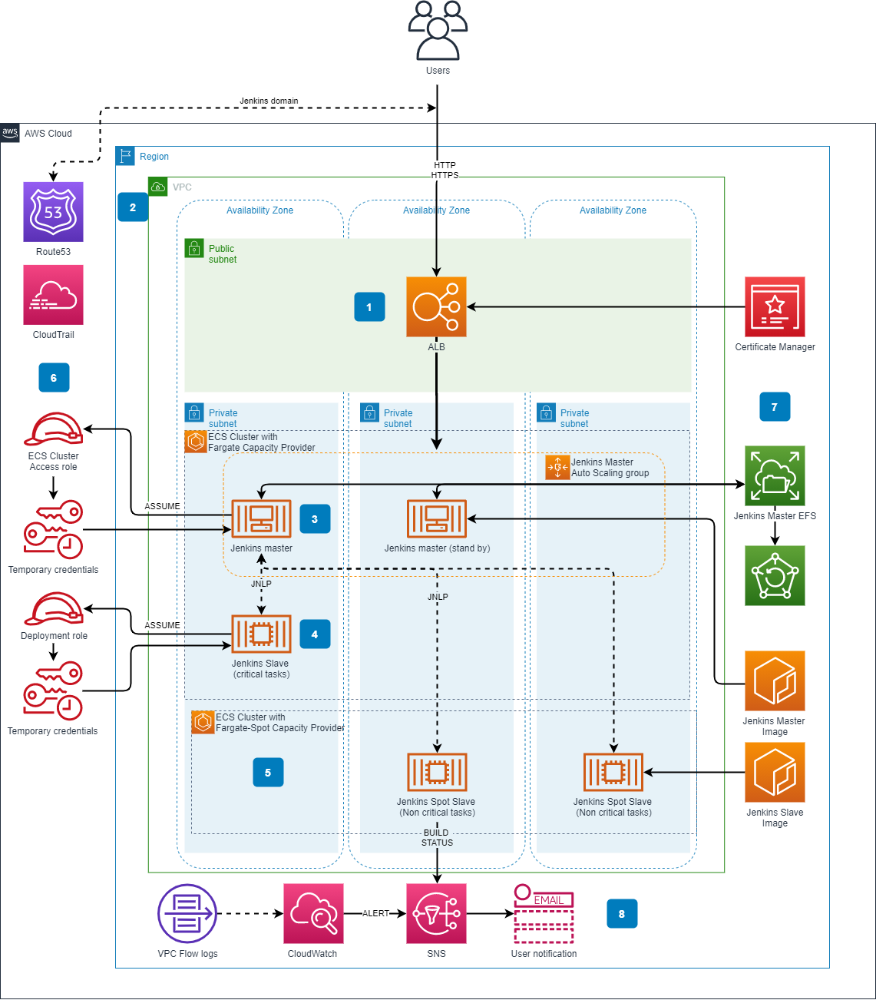

# AWS Serverless Jenkins Terraform Module
Terraform module which creates a serverless Jenkins environment based on AWS Fargate. The following resources are created:

* Two Amazon ECS clusters
    * One utilizing the standard `FARGATE` capacity provider, which is to be used by the Jenkins controller and high priority agents.
    * One utilizing the `FARGATE_SPOT` capacity provider, which is to be used by Jenkins agents which handle lower priority jobs.
* Amazon ECS service and task for Jenkins controller.
* Jenkins controller Docker container, including the [amazon-ecs-plugin](https://github.com/jenkinsci/amazon-ecs-plugin).
* Amazon ECR repository for storing the above container
* Application load balancer
* Amazon Elastic Filesystem to provide stateful storage for the Jenkins controller
* AWS Backup vault and schedule to backup EFS
* AWS Cloud Map service discovery domain and entry for Jenkins controller (for agent -> controller discovery)
* IAM Roles for the above components
* Security Groups for the above components

An example is included in the `example` directory.
## Prerequisites
The following are required to deploy this Terraform module

1. Terraform 0.14+  - Download at https://www.terraform.io/downloads.html
1. Docker 19+ - Download at https://docs.docker.com/get-docker/
1. A VPC with at least two public and two private subnets. Private subnets will require to have NAT gateway to be able to access resources such as secret manager, as well as update for Jenkins. 
1. An SSL certificate to associate with the Application Load Balancer. It's recommended to use an ACM certificate. This is not done by the main Terraform module. However, the example in the `example` directory uses the [public AWS ACM module](https://registry.terraform.io/modules/terraform-aws-modules/acm/aws/latest) to create the ACM certificate and pass it to the Serverless Jenkins module. You may choose to do it this way or explicitly pass the ARN of a certificate that you had previously created or imported into ACM.
1. An admin password for Jenkins must be stored in SSM Parameter store. This parameter must be of type `SecureString` and have the name `jenkins-pwd`. Username is `ecsuser`.
1. Terraform must be bootstrapped. This means that a state S3 bucket and a state locking DynamoDB table must be initialized.

## Deployment
This is packaged as a Terraform module, which means it's not directly deployable. However, there is a deployable example in the `example` directory. To deploy the example:

1. Ensure you have met all the Prerequisites
1. If necessary, execute the bootstrap in the bootstrap directory. This will create a Terraform state bucket & state locking table. This step may be unnecessary if you already have an established Terraform environment.
1. copy `vars.sh.example` to `vars.sh`
1. Edit the variables in `vars.sh` as necessary giving all details specific to your environment (VPC, subnets, state bucket & state locking table, etc.)
1. Run `deploy_example.sh`

## Module Variables

| Variable  | Description | Type | Default | Required |
| ---      |  ------  |----------|----------|----------|
| `jenkins_ecr_repository_name` | Name for the ECR repository to be created by this module | `string` | `serverless-jenkins-controller`  | `Yes`|
| `name_prefix` | String to prepend to all created resources | `string` | `serverless-jenkins`  | `Yes`|
| `vpc_id` | The VPC ID for the VPC where resources will be deployed | `string` | `None`  | `Yes`|
| `efs_enable_encryption` | Should the created EFS filesystem be encrypted? | `bool` | `true`  | `Yes`|
| `efs_kms_key_arn` | The KMS key ARN used to encrypt the EFS filesystem | `string` | `aws/elasticfilesystem` | `Yes`|
| `efs_performance_mode` | The EFS performance/billing mode. Can be `generalPurpose` or `maxIO`. | `string` | `generalPurpose` | `Yes`|
| `efs_throughput_mode` | The EFS throughput/billing mode. Can be `bursting` or `provisioned`. | `string` | `bursting` | `Yes`|
| `efs_provisioned_throughput_in_mibps` | The EFS provisioned throughput value in MiBps. Only applicable if `efs_throughput_mode` is `provisioned`. | `number` | `None` | `No`|
| `efs_ia_lifecycle_policy` | The EFS lifecycle management policy for infrequent access files. See the [docs](https://docs.aws.amazon.com/efs/latest/ug/lifecycle-management-efs.html) for values. | `string` | `None` | `No`|
| `efs_subnet_ids` | The VPC subnet IDs where EFS should be connected. It is recommened that this be private subnets. | `list(string)` | `None` | `Yes`|
| `efs_access_point_uid` | The POSIX UID to associate with the EFS filesystem endpoint. This must match the jenkins user UID to enable writing to the fileystem | `number` | `1000` | `Yes`|
| `efs_access_point_gid` | The POSIX GID to associate with the EFS filesystem endpoint. This must match the jenkins user GID to enable writing to the fileystem | `number` | `1000` | `Yes`|
| `efs_enable_backup` | Should backups of EFS be enabled using AWS Backup? | `bool` | `true` | `Yes`|
| `efs_backup_schedule` | An AWS Cron string defining the backup schedule for the EFS Fileystem. | `string` | `cron(0 00 * * ? *)` | `Yes`|
| `efs_backup_start_window` | The amount of grace time in minutes given to the backup job in order to start. If the job does not within this period it will be canceled. | `number` | `60` | `Yes`|
| `efs_backup_completion_window` | The amount of time in minutes that the backup has to complete. If the backup job is not completed within this period it will be canceled. | `number` | `120` | `Yes`|
| `efs_backup_cold_storage_after_days` | The number of days before old backups are moved to cold storage. | `number` | `30` | `No`|
| `efs_backup_delete_after_days` | The number of days before old backups are Deleted. If cold storage transition is enabled then this number must be greater than `90`. | `number` | `120` | `No`|
| `alb_type_internal` | Should the ALB be of type `internal`. If internal, access to the Jenkins UI will be restricted such that it is accessible only from the VPC. | `bool` | `false` | `Yes`|
| `alb_enable_access_logs` | Should access logging be enabled on the ALB.  | `bool` | `false` | `Yes`|
| `alb_access_logs_bucket_name` | The S3 bucket where ALB access logs are sent if `alb_enable_access_logs` is `true`. This bucket and its policy must already be setup according to the [docs](https://docs.aws.amazon.com/elasticloadbalancing/latest/application/load-balancer-access-logs.html) | `string` | `None` | `No`|
| `alb_access_logs_s3_prefix` | S3 object prefix for ALB access logs if enabled | `string` | `None` | `No`|
| `alb_create_security_group` | Should a security group allowing all traffic on ports 80 * 443 be created for the alb. If false, a valid list of security groups must be passed with `alb_security_group_ids`  | `bool` | `true` | `Yes`|
| `alb_security_group_ids` | A list of security group ids to attach to the Application Load Balancer. Only needed if `alb_create_security_group` is `false`.  | `list(string)` | `None` | `No`|
| `alb_ingress_allow_cidrs` | A list of cidrs to allow inbound into Jenkins on ports `80` and `443`. It is recommended to limit this to as small a set of IPs as possible. | `list(string)` | `None` | `No`|
| `alb_subnet_ids` | A list of VPC subnet IDs where the ALB will be deployed. | `list(string)` | `None` | `Yes`|
| `alb_acm_certificate_arn` | The ARN of an ACM certificate to use with the ALB. | `string` | `None` | `Yes`|
| `jenkins_controller_port` | The port on which the jenkins container listens on. This is used to route traffic from public ports to container ports. | `number` | `8080` | `Yes`|
| `jenkins_jnlp_port` | The JNLP port used for communication between the Jenkins controller and agent. | `number` | `50000` | `Yes`|
| `jenkins_controller_cpu` | The amount of CPU to dedicate to the fargate task. This must be one of the accepted Fargate [options](https://docs.aws.amazon.com/AmazonECS/latest/developerguide/task-cpu-memory-error.html).| `number` | `2048` | `Yes`|
| `jenkins_controller_meory` | The amount of memory to dedicate to the fargate task. This must be one of the accepted Fargate [options](https://docs.aws.amazon.com/AmazonECS/latest/developerguide/task-cpu-memory-error.html).| `number` | `4096` | `Yes`|
| `jenkins_controller_task_log_retention_days` | The number of days to retain CloudWatch logs for the Jenkins fargate task. | `number` | `30` | `Yes`|
| `jenkins_controller_subnet_ids` | The VPC subnet IDs where the Jenkins Fargate tasks will be deployed. It is recommended to use private subnets. | `list(string)` | `None` | `Yes`|
| `jenkins_controller_task_role_arn` | An optional role ARN to use as the Jenkins controller Fargate task role. A role is created if not specified. | `string` | `None` | `No`|
| `ecs_execution_role_arn` | An optional role ARN to use as the ECS execution role. A role is created if not specified.| `string` | `None` | `No`|
| `route53_create_alias` | Should a Route53 alias be created? `route53_zone_id` and `route53_alias_name` must also be specified. | `string` | `None` | `No`|
| `route53_zone_id` | The Route53 zone ID where the DNS record should be created. | `string` | `None` | `No`|
| `route53_alias_name` | The Route53 alias name to create. | `string` | `jenkins-controller` | `No`|
| `tags` | A map of AWS resource tags to be applied to all resources. | `map(any)` | `None` | `Yes`|

## Security

See [CONTRIBUTING](CONTRIBUTING.md#security-issue-notifications) for more information.

## License

This library is licensed under the MIT-0 License. See the LICENSE file.
